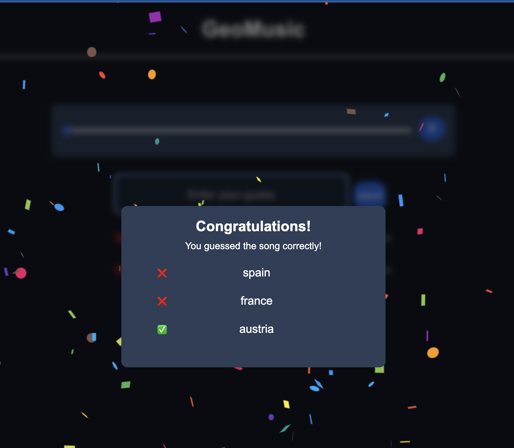

# 🎵 Country Guessing Game

An engaging web app where users guess the countries of origin of classical music masterpieces. Featuring a music player, dynamic country suggestions, celebratory confetti animations, and a winning modal, the game delivers an interactive experience for music and geography enthusiasts.

Progress is saved using cookies, ensuring seamless continuation across sessions. Powered by a Go backend server, the app updates with a new song daily, offering a fresh challenge every day.

## Important Note:

Links of music in the current implementation is dependent on the server setup. In this version, songs are stored in the same directory and selected using an index. The feature to link and fetch songs dynamically will be implemented based on future server configuration.

## Technologies Used

- Typescript
- React.js
- Go
- MongoDB
- Cookies for state saving

## Features in Progress

- Improvement of the game lookings
- Leaderboard implementation
- New game mechanics
  - Choosing directly on a map
  - Guessing author
  - to be seen ..

## Pictures

### Game initial menu

### Guessed countries

### Country correctly guessed

